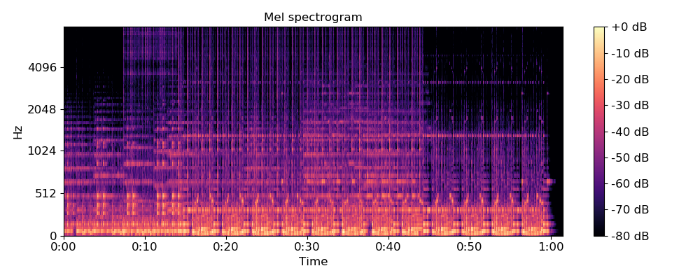
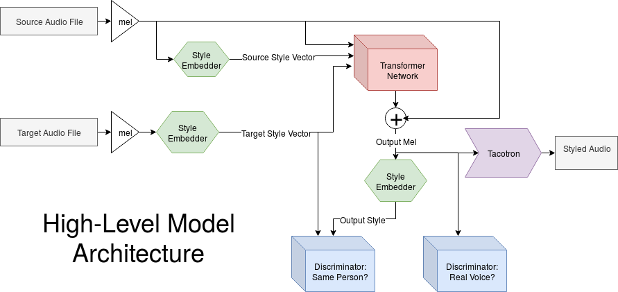
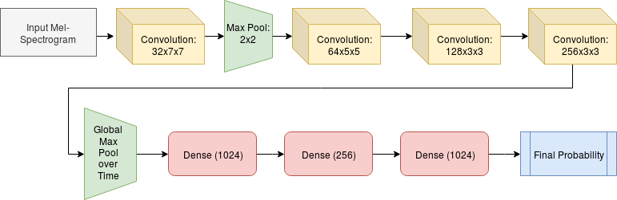

# One-Shot Vocal Imitation
CS7643 Final Project by Alex Le, Anish Moorthy, Arda Pekis, Joel Ye

## Introduction
For our project, we attempted to perform style transfer on voices: given an audio clip from speaker A, we attempt to produce another audio clip with the same content (volume modulation, timing, etc), but which sounds like it was spoken by speaker B.

Voice cloning has been a topic of interest for many years now, but up until recently many models have required an abundance of source / target training data for a single sample [1] (on the order of 5-10 hours of training data). In recent years, much progress has been made: to our knowledge, the current SOTA model is [3] which can indeed produce good results with little data. However even this model uses text as an intermediate representation, an embedding which ignores many important aspects of spoken communication such as intonation and timing. 

To surpass these limitations, we aimed to perform data-efficient style transfer without the use of test as an intermediate representation. Such technology would have many real-world applications, especially in the modern entertainment industry where it could be used to preserve iconic voices for use in future media. This technology could also theoretically be used to adapt an actors voice to fit the role of the film, meaning that actors may no longer need months of training to build or remove an accent. This technology could also be useful in the human interactive field for personalizing a user’s Siri, Google Assistant, Alexa or Cortana. Having a similar accent could improve the performance and usefulness of these applications.

## Approach
We used Pytorch as our framework. For our data-embedding, we preprocess into log-mel spectrograms, a 2d-representation of audio with time on one axis and frequency on the other. We chose this embedding for two key reasons. First, log-mel spectrograms are a standard embedding for working with audio data, and so there exist sophisticated tools for converting them back to audio: we use Nvidia’s open-source WaveGlow [2] network for this exact purpose. We verified that the existing implementation provided produces convincing reconstructions of our mel embeddings of audio clips. Second, they allow us to use (and indeed, are a natural target for) Convolutional Neural Networks throughout our architecture.

We chose a generative model architecture, illustrated below, designed to counter anticipated problems. The Transformer Network (corresponding to the generator) attempts to, given a source audio file and target style vector, output another audio file which has low distance from the target style vector. Content similarity is enforced via the residual connection across the transformer network, which biases the transformer towards producing something similar to the input mel: the source of the content information which we wish to preserve. To prevent the model from simply producing noise which is overfit to the style embedder, we include two discriminators: one for determining whether the output sounds like a voice, and another for determining whether it is an original or transformed voice. 

We believed that this model was suited to our objective because it offered a clear target to be made data-efficient: the style embedder. Using small amounts of source and target data (as was our goal), it would have been difficult to train the model end-to-end from scratch. However using a large dataset such as VoxCeleb to train the Style Embedder to efficiently estimate future audio samples would make the problem easier: assuming a “reliable” style embedder, the Transformer and Discriminator networks do not have to be architected around data efficiency and can also be trained using large datasets.

In summary, the style embedder and waveglow reconstruction modules exist independently, and the transformer and discriminators are the bulk of the model to be trained. <TODO A note about hyperparameters @Arda>

### Discriminators
For the IsVoice? discriminator, the 2d data allows us to employ CNNs, which have been demonstrated to be suited for audio classification [5][6] [from poster, check references). The following architecture is adapted from [6] to accommodate variable time-length data

For the OriginalVoice? discriminator, we decided to use atan(||starget-soutput||), where soutput is the style embedding of the transformer’’s output. We considered a Siamese Network instead, but decided against it due to (a) potential to overfit and (b) added model parameters which would inflate complexity and training times.

As described in Goodfellow’s original paper on GANs, both discriminators output a probability that their input belongs to the True (as opposed to Generated) distribution. We  train the IsVoice? Discriminator via minimizing the binary cross-entropy between its prediction and  the true label (either real or generated) of an input sample.

After a batch of discriminator training, the Transformer is trained to minimize 
L(z) = BCE(D1(G(z)), 1) + BCE(D2(G(z)), 1)
(in our scheme, “1” is the label for “real” data). Thus, the Generator attempts to produce voices which sound “untransformed” and “like a real voice” as defined by the discriminators.

### Style Embedder
The style embedder is adapted from the Deep Speaker model [8], which learns utterance-level speaker embeddings to classify different speakers. We re-purpose these embeddings as style vectors to be used by the transformer. The style embedder is built with a Residual Network with average pooling over frame-level input, affine layer, and length normalization layer at the end as shown in figure below.

The embedder is pre-trained in a 2 step process, Cross Entropy Loss + Triplet Loss and just Triplet Loss. Having an initial softmax training process results in more stable convergences and produces better results. Triplet loss with cosine similarity is designed to captured the differences in different people's voice, but similarities in one person's voice with different dialogues as shown below. L(a, p, n) = san - sap + ∝

## Experiments and Results
Vocal imitation, as a type of style transfer, is difficult to evaluate objectively. A typical strategy used for style transfer results is Mean Opinion Survey, where opinions on task success (here, whether the source style is expressed in target clip), are gathered and averaged. However, we did not gather these quantitative scores after initial assessment of our results, which clearly did not convey the target styles, meaning failure for the overall system. Examples are provided below.

Our main experiment looked at the effects of adding a residual connection as shown in our architecture map, compared to simply having the transformer create an output mel. The samples indicate that not providing a residual connection produces non-random but meaningless noise. However, the residual connection preserved content, causing the overall mel to be distorted. We believe that this noisy distortion is fooling the SamePerson discriminator, meaning our model suffers from ma combination of improper GAN tuning and insufficient training time. 

Realization of poor results indicate a few directions we could try to improve. A more rigorous assessment of each component could reveal unexpected behavior that would bring down the whole models performance. 
<Arda> send some further insight. Include mel images.

## Samples 
Provided below are a random selection of clips generated by our system. No residual connection results omitted (they are unpleasant to listen to!)

#### Voice reconstruction (WaveGlow):
[Original](pending)
[Reconstructed](https://raw.githubusercontent.com/joel99/vocal-mimicry/gh-pages/assets/synth_reconstruct/p300_001_synthesis.wav)

#### Residual connection enabled:
[Source Content](https://raw.githubusercontent.com/joel99/vocal-mimicry/gh-pages/assets/raw/p226_002.wav)

[Source Style](https://raw.githubusercontent.com/joel99/vocal-mimicry/gh-pages/assets/raw/p225_001.wav)

[Transferred](https://raw.githubusercontent.com/joel99/vocal-mimicry/gh-pages/assets/waves_with_res/new_p226_002_p225_001_synthesis.wav)

[Source Content](https://raw.githubusercontent.com/joel99/vocal-mimicry/gh-pages/assets/raw/p231_002.wav)

[Source Style](https://raw.githubusercontent.com/joel99/vocal-mimicry/gh-pages/assets/raw/p232_003.wav)

[Transferred](https://raw.githubusercontent.com/joel99/vocal-mimicry/gh-pages/assets/waves_with_res/new_p231_002_p232_003_synthesis.wav)

Full samples can be found [here](https://drive.google.com/drive/folders/1DkMnvIJAAZfhHzJqI3e2uVBKnalxsZpB?usp=sharing)
Naming convention is “target_source.wav” where target is the clip’s whose audio . Original VCTK audio files are also provided.

## References
1. Sercan Arik et al. “Deep Voice: Real-time Neural Text-to-Speech” (Feb 2017)
2. Ryan Prenger, Rafael Valle, Bryan Catanzaro. “WaveGlow: A Flow-based Generative Network for Speech Synthesis” (Oct. 2018)
3. Sercan Arik et al. “Neural Voice Cloning with a Few Samples” (Feb 2018)
4. Librosa librosa.feature.melspectrogram Documentation
5. Hershey et al. “CNN Architectures for Large-Scale Audio Classification” (2017)
6. Hossein Salehghaffari. “Speaker Verification using Convolutional Neural Networks” (Mar 2018)
7. Ian Goodfellow et al. “Generative Adversarial Networks” (Jun 2014)
8. Chao Li et al. “Deep Speaker: an End-to-End Neural Speaker Embedding System” (2017)

